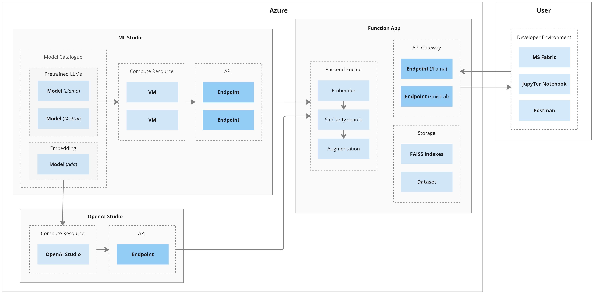

## RAG-based Query Engine with ML Studio Pre-trained Models and hosted on Azure Function App

This repository is part of the RAGNalysis project. This code is more focused on the cloud infrastructure rather than the retrieval component of RAG.

<br>

### Architecture



<br>

### Usage

Refer to the `experiment.ipynb` file for sample usage.

<br>

### Development

> Note: For pushing directly from VSCode to Azure Function App, you will need VSCode v1.87.1. This is not the version on Company Portal 

For setting up the project for development:

1. Clone the repository
2. Add a `.env` file in the root directory with the below template. The API keys can be found in the ML Studio and OpenAI Studio endpoints pages (under the 'Consume' tab). 

```
MISTRAL_KEY=
LLAMA_KEY=
EMBEDDING_KEY=
FUNCTION_KEY=
```

3. Ensure the endpoint and deployment variables in `function_app.py` match the endpoints on Azure ML Studio

```py
if model == 'llama':
    endpoint = 'jludq'
    deployment = 'llama-2-7b-chat-18'
elif model == 'mistral':
    endpoint = 'ebbtk'
    deployment = 'mistralai-mistral-7b-instruct-5'
```

4. Install the 'Azure Functions App' extension and sign into Azure via this extension
5. Use the extension to locally test the endpoint. This creates endpoints on localhost that you can make `get` requests to via the URL (or Python code)


6. Use the extension to publish the code to Azure Function App OR push to GitHub, get it into the main branch, and run the GitHub Actions workflow to update the Azure Function App


