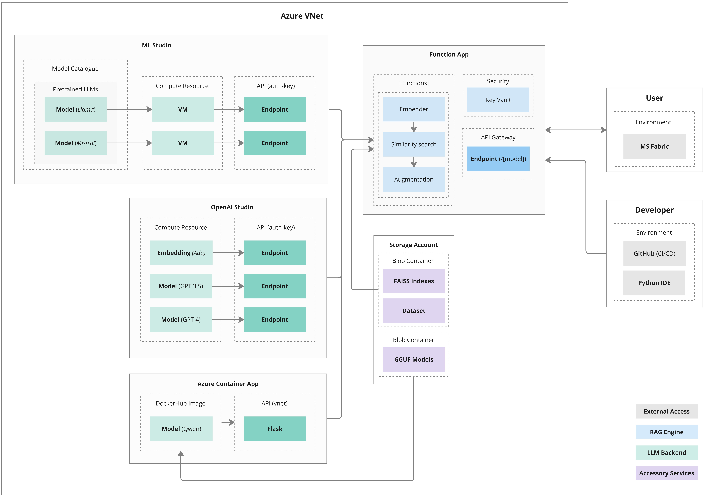
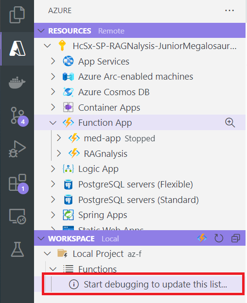
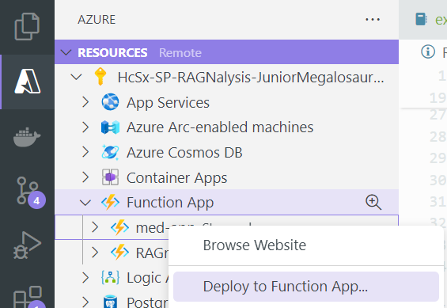
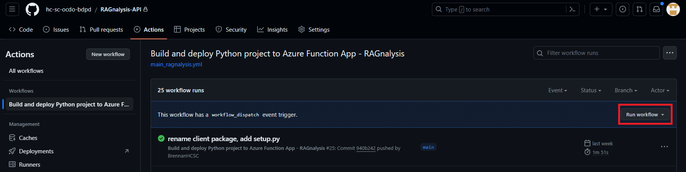

## RAG-based Query Engine Deployed in Azure Function App with Azure-hosted Pre-trained Models

This repository is part of the RAGNalysis project to create a RAG-based search engine for corporate data (essentially a private chatGPT).

<br>

### Architecture



* **LLM Backend**: This layer provides the pretrained LLM models for embedding and inference. 3 different Azure resources are used for experimentation purposes, but in production, only a single provider and model will be used.
    * _ML Studio_: Provides easily deployable endpoints for common LLM models. Most endpoints are real-time and operate 24/7 so these are the most inflexible and expensive models to host. Alternatively, custom models can be deployed via PromptFlow through ML Studio.
    * _AI Studio_: Provides pay-as-you-go endpoints for the far more powerful GPT models that cannot be self-hosted due to their size.
    * _Containerized App_: Provides very flexible access to models via GGUF files from HuggingFace, but take longer to set up compared to ML Studio models and are weaker than AI Studio models.

* **RAG Engine**: This is the 'heart' that connects to all the infrastructure. It connects to the LLM Backend layer based on the user-specified model to generate an augmented response. It also provides the public endpoints that end-users can call. 
    * _Azure Function App_: This is an Azure resource specialized around event-driven microservices with short processes. Two alternatives are Azure Container Apps (for standalone applications) and Azure Web Application (for websites).

* **Accessory Services**: A centralized storage for the model files, dataset, and FAISS index.


<br>

### Usage

Refer to the demo notebook for data models and usage. This code is also present in the MS Fabric environment

* `experiment.ipynb`: Demo of the inference API via the `RagnalysisClient` class that wraps around the API. 

Running this notebook requires an API key that must be defined in a `.env` file at the project root directory. Create a `.env` file and paste the API key in the following field:

```
FUNCTION_KEY=
```

<br>

### File Structure

This repository contains both the Function App code (`app/`) and the user-facing experiment code. An overview of the files:

---------------------------------------------------------------------------------
| File | Purpose |
| ---- | ------- |
| `app/.funcignore` | Like `.gitignore` but for excluding files that get pushed to the Function App |
| `app/function_app` | API routing for the function app. Routes requests to `backend.py` for processing |
| `app/backend.py` | Processor for the function app. Does the computations and accesses the necessary storage |
| `app/utils.py` | Utility functions to help process requests in `backend.py` | 
| `app/host.json` | Configuration for the function app (ex bindings to other Azure service) |
| `app/local.settings.json` | (must be manually created) Like a `.env` file. Provides access to private keys that exist in the Function App environment | 
| `.github/main_med-app.yml` | Action for building and deploying the Function App to Azure | 
| `.github/unit_tests.yml` | Action for running the unit tests in `tests/` | 
| `api/app.py` | Wrapper class to simplify usage of the Function App API |
| `setup.py` | Project metadata |
| `experiment.ipynb` | Demo code for using the repo to access the Function App |

<br>

### Development: Setup and CI/CD

> Note: For pushing directly from VSCode to Azure Function App, you will need VSCode v1.87.1. This is not the version on Company Portal 

For setting up the project for development:

1. Clone the repository
2. Add a `.env` file in the project root directory (for using the experiment notebook) with the below template. Please contact a developer for the API key. Alternatively, you could try to find them through Azure:
    * **Function Key** (`FUNCTION_KEY`): This is the Azure Functions App key that is found in the `App Keys` section of the Function App

```
FUNCTION_KEY=
```

3. Create a `local.settings.json` file in the `app` directory. The purpose of this file is to simulate the Azure environment by defining environment variables that are only accessible in the Azure environment. Contact a developer for these 

```py
{
  "IsEncrypted": false,
  "Values": {
    "AzureWebJobsStorage": "",
    "FUNCTIONS_WORKER_RUNTIME": "python",
    "AzureWebJobsFeatureFlags": "EnableWorkerIndexing",
    "BlobStorageConnectionString": "",
    "OPENAI_KEY": "",
    "CONNECTION_STRING": "",
    "STORAGE_KEY": "",
    "STORAGE_URL": "",
    "STORAGE_CONTAINER": "app-data",
    "MISTRAL_MODEL": "mistralai-mistral-7b-instruct-5",
    "MISTRAL_ENDPOINT": "jludq",
    "MISTRAL_KEY": "",
    "LLAMA_MODEL": "llama-2-7b-chat-18",
    "LLAMA_ENDPOINT": "ebbtk",
    "LLAMA_KEY": ""
  }
}
```

4. Install the 'Azure Functions App' extension and sign into Azure via this extension
5. Use the extension to locally test the endpoint. This creates endpoints on localhost that you can make `get` requests to via the URL (or Python code). You may have to: 
  * re-open VSCode to the `app` directory as the root directory
  * install the Azure Function toolkit through the website or through `npm`. The extension is a wrapper around this toolkit; you can use the toolkit itself to start a local server via `func start` in the `app/` directory
  * manually create a `.venv` in the `app` directory



6. Use the extension to publish the code to Azure Function App OR push to GitHub, get it into the main branch, and run the GitHub Actions workflow to update the Azure Function App





<br>

### Development: Testing

Unit tests are defined in the `tests/` directory. They call a mocked version of the local function app which does not require a server to be running. However, this requires a `temp.txt` file be defined in the project root directory that contains all the keys in `local.settings.json`:

```
AzureWebJobsStorage=
FUNCTIONS_WORKER_RUNTIME=
AzureWebJobsFeatureFlags=
BlobStorageConnectionString=
OPENAI_KEY=
FUNCTION_KEY=
CONNECTION_STRING=
STORAGE_KEY=
STORAGE_URL=
STORAGE_CONTAINER=
MISTRAL_MODEL=
MISTRAL_ENDPOINT=
MISTRAL_KEY=
LLAMA_MODEL=
LLAMA_ENDPOINT=
LLAMA_KEY=
```

The reason for this file is that we want to have the function app run in CI/CD for unit testing, but we can't push `.env` files to GitHub. Therefore, we have `.env` private keys in GitHub secrets, and a `temp.txt` file is produced in the `unit_tests.yml` GitHub Actions file during runtime. This `temp.txt` file exists locally for local testing purposes but is not pushed to GitHub. Ultimately both `temp.txt` and `local.settings.json` accomplish the same task of populating environment variables in `os.environ` to emulate keys that exist in Azure, but `temp.txt` is for local unit testing and `local.settings.json` is for local deployment.

Run the following command to execute the tests (from the project root directory):

```py
pytest --log-cli-level=INFO tests/
```

<br>

### Development: Adding models

> Remember to add any new private keys to `temp.txt` (for unit testing), `local.settings.json` (for local deployment), the Function App `Configuration` page (for cloud deployment), and GitHub secrets (for CI/CD)

Currently, the LLM models are sourced from either ML Studio, AI Studio, or a Container App. Adding models from additional sources may require the addition of new functions. To add a model from one of the existing sources, follow the below guide:

1. Add the endpoint to `app/function_app.py`. Choose any name but be consistent with it
2. Add the necessary API keys to `local.settings.json` and also manually add them to the Function App in Azure via the `Configuration` page. The `local.settings.json` file's purpose is actually to emulate access to these private keys as they live on the Cloud but we want to do experimentation locally. 
3. In `app/backend.py`:
  * If applicable, add API rate information to the `LLM_RATES` constant. This is for pay-as-you-go APIs
  * Add your model name to the `self._augment(self)` method based on where the model is coming from. If it is a container app, then the `_containerized_model(self)` method must be updated by changing the request URL. One way to do this is by making the request URL dynamic via environment variables, similar to the setup with `MISTRAL` and `LLAMA` prefixes in `local.settings.json`
4. Test the endpoint by running the Function App locally (using the VSCode extension or toolkit) and sending an API request

### Development: Enabling models

The container app and ML Studio LLMs are disabled as they run on real-time endpoints which charge an hourly fee, as opposed to the more preferred pay-as-you-go endpoints in AI Studio. To re-enable the ML studio and container app models, see below:

* **ML Studio**: These models must be re-created as their endpoints are auto-deleted after 7 days. Go to the `Model Catalog` in ML Studio and find the text-based LLM of choice. Deploy the endpoint (pay-as-you-go, if possible; but real-time otherwise) and copy over the endpoint prefix, API key, and model name to `local.settings.json` as new environment variables. The endpoint takes a while to make (~10 minutes), and is not fully provisioned until the 'Consume' tab is visible in the endpoint page. Remember to also add the keys to the `Configuration` menu on the Function App in Azure.

* **Container App**: Go to the `localai-selfhost` Container App and turn it on. This will take about 8 minutes to fully wake up, but the model should be accessible afterward. 